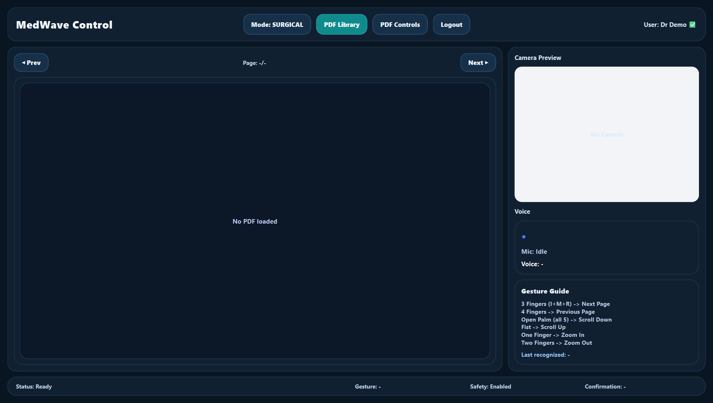
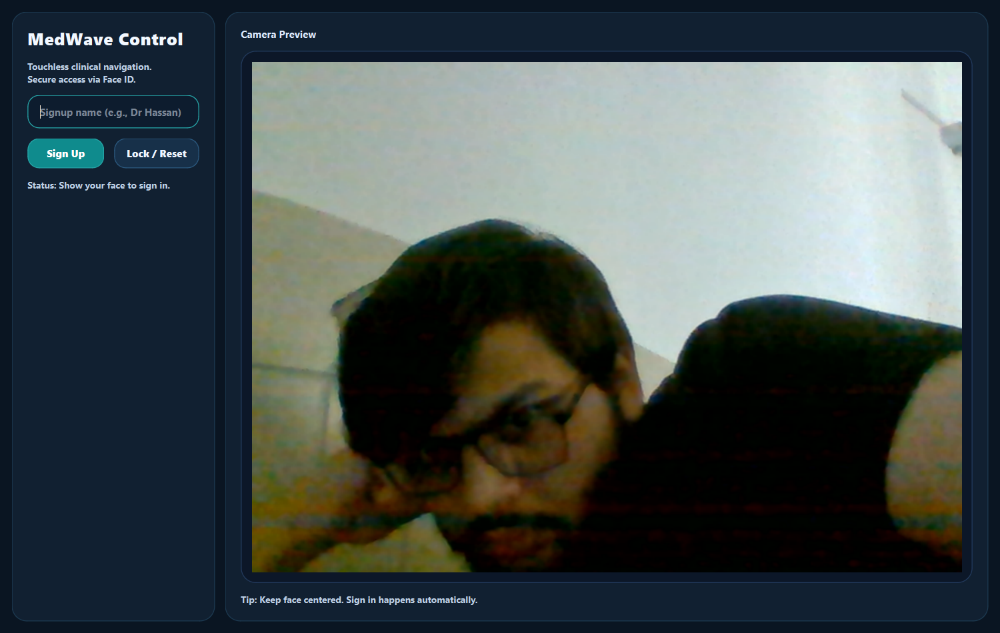

# MedWave

**Touchless gesture control for sterile clinical workflows.**

MedWave is a computer vision based desktop system that lets medical professionals control digital documents and imaging workflows using hand gestures instead of physical input devices. It is designed for sterile clinical environments where touching a keyboard, mouse, or screen can interrupt procedure flow and increase contamination risk.


## Quick Start

```bash
python -m venv .venv
.venv\Scripts\activate
pip install -r requirements.txt
python main.py
```

## About

Gesture Healthcare Control, branded as **MedWave**, uses OpenCV, MediaPipe, PyAutoGUI, and PySide6 to capture camera input, detect hand landmarks in real time, and map predefined gestures to system actions such as scrolling, zooming, and navigating medical PDFs. The project demonstrates how AI powered human-computer interaction can improve safety, reduce dependency on assistants, and support more modern hospital workflows.

## Showcase

Add screenshots to `docs/screenshots/`, then they will render here automatically:




## The Problem

Surgeons and clinical staff often need to view patient data, radiology reports, scans, or lab documents during procedures. In sterile environments, directly touching shared devices can break sterility and slow down decision making. Teams may need an assistant to operate the computer, which adds friction and can delay navigation through critical information.

## The Solution

MedWave provides a contactless control layer for clinical documents. A camera reads hand movement, the gesture engine interprets the action, and the interface responds without requiring touch. The system is built around practical clinical actions: opening reports, moving between pages, scrolling, and zooming into details.

## Key Features

- Real-time hand landmark detection with MediaPipe
- Touchless PDF navigation for medical reports and imaging documents
- Gesture controls for scrolling, zooming, and page movement
- Face based user authentication using OpenCV
- Optional offline voice commands using Vosk
- Safety layer to reduce accidental commands
- PySide6 desktop interface with camera preview, status indicators, and document viewer
- Local-first design: private user data stays on the machine

## Gesture Workflow

MedWave detects hand landmarks from the live camera feed and evaluates gestures through a safety layer before executing actions.

| Action | Purpose |
| --- | --- |
| 3 fingers (index + middle + ring) | Next page |
| 4 fingers | Previous page |
| Open palm (all 5 fingers) | Scroll down |
| Scroll up | Move document upward |
| Zoom in | Enlarge report or image |
| Zoom out | Reduce zoom level |

## Voice Commands

Voice control is optional and works offline when the Vosk model is installed. Commands use the wake phrase:

```text
hey health
```

Example commands:

- `hey health open pdf`
- `hey health next page`
- `hey health previous page`
- `hey health zoom in`
- `hey health zoom out`
- `hey health reset zoom`
- `hey health scroll up`
- `hey health scroll down`

## Tech Stack

- **Python** for application logic
- **OpenCV** for camera handling and face authentication
- **MediaPipe** for hand landmark detection
- **PyAutoGUI** for system-level action execution
- **PySide6** for the desktop interface
- **PyMuPDF** for PDF rendering
- **Vosk + SoundDevice** for optional offline voice recognition

## Project Structure

```text
core/
  action_executor.py      System action execution
  camera_worker.py        Camera capture and hand landmark detection
  face_auth_manager.py    Face enrollment and authentication
  gesture_engine.py       Gesture classification
  safety_layer.py         Command approval and safety checks
  voice_worker.py         Offline voice command listener

ui/
  auth_window.py          Login and enrollment interface
  main_window.py          Main MedWave workspace
  pdf_viewer.py           Medical PDF viewer and library
  theme.py                Desktop UI styling
  widgets.py              Camera and status widgets

models/
  hand_landmarker.task    MediaPipe hand landmark model

main.py                   Application entry point
```

## Installation

Create and activate a virtual environment:

```bash
python -m venv .venv
.venv\Scripts\activate
```

Install dependencies:

```bash
pip install -r requirements.txt
```

Run the application:

```bash
python main.py
```

## Current Interaction Map

- 3 fingers (index + middle + ring): next page
- 4 fingers: previous page
- open palm (all 5 fingers): scroll down
- fist: scroll up
- one finger: zoom in
- two fingers: zoom out
- voice wake phrase: `hey health`

## Demo Script (for presentations)

Use this 60-90 second flow during demos:

1. Start on auth window and complete face login.
2. Open `PDF Library` and load a sample report.
3. Show page control using 3-finger and 4-finger gestures.
4. Show zoom and scroll gestures.
5. Trigger 1-2 voice commands starting with `hey health`.

## Optional Voice Model

Voice commands require the Vosk small English model. Download and extract it into:

```text
assets/vosk-model-small-en-us-0.15/
```

If the model is not present, MedWave still runs and gesture control remains available.

## Troubleshooting

- Voice not working: verify the model exists at `assets/vosk-model-small-en-us-0.15/` and that your microphone is enabled.
- Camera not detected: switch camera index in `main.py` / `ui/main_window.py` (for example, `cam_index=1`).
- Slow or noisy gesture detection: improve lighting and keep your hand centered in the camera preview.
- Dependency errors: run `pip install -r requirements.txt` inside your virtual environment again.

## Privacy

MedWave is designed to keep sensitive runtime data local. The following files and folders are intentionally excluded from Git:

- `auth_faces/`
- `auth_model.yml`
- `auth_labels.json`
- `uploads/`
- common image formats such as `.jpg`, `.jpeg`, `.png`, `.webp`, and `.bmp`
- the local Vosk speech model

This protects face enrollment images, authentication models, uploaded clinical documents, and local assets from being published accidentally.

## Roadmap

- Improve gesture calibration controls from the UI
- Add packaged installer build for easier deployment
- Expand test coverage for gesture, voice, and safety flows
- Add optional per-user gesture sensitivity profiles

## GitHub About Text
Repository metadata is set to:

- Description: `MedWave is a computer vision based touchless control system for sterile healthcare environments, using hand gestures and voice commands to navigate medical PDFs and digital workflows without physical contact.`
- Topics: `computer-vision`, `healthcare`, `gesture-control`, `opencv`, `mediapipe`, `pyside6`, `touchless-interface`, `medical-imaging`, `python`, `human-computer-interaction`

